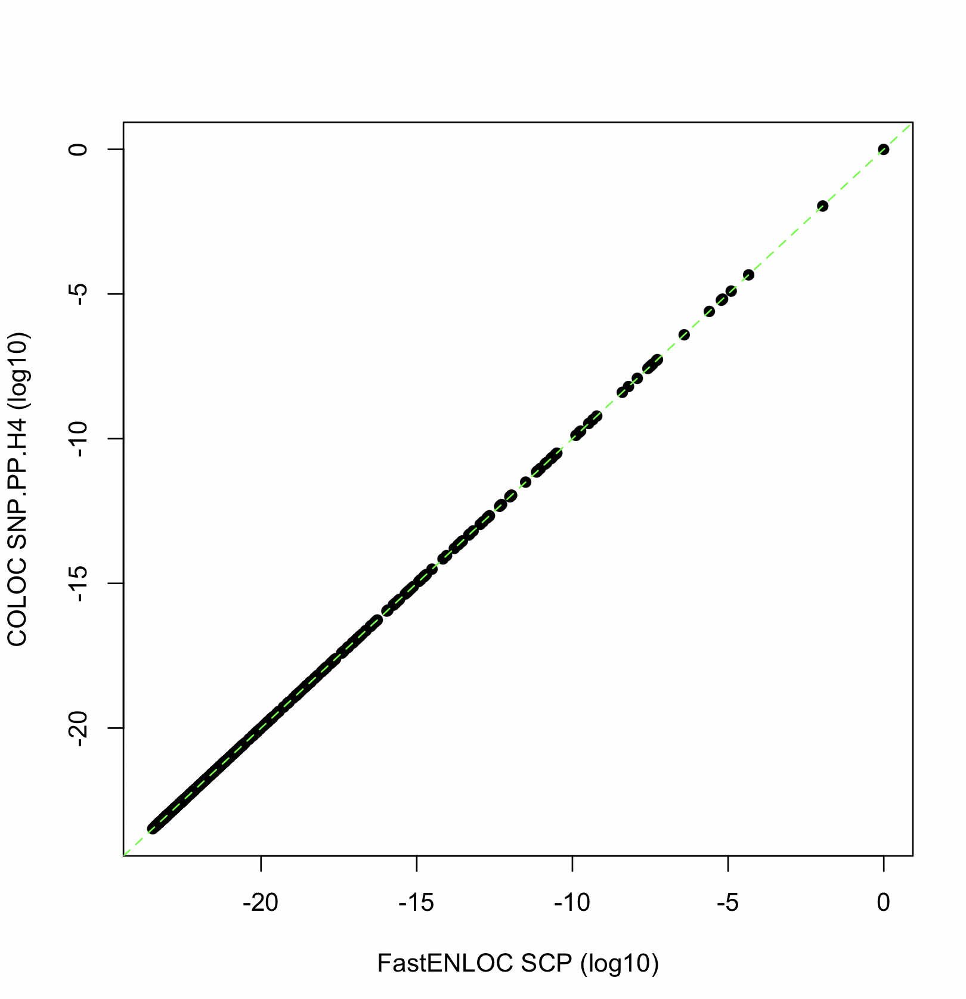

# FastENLOC vs. Coloc using Summary Statistics Input

When summary statistics are used as input for colocalization analysis, both COLOC and FastENLOC require the same simplifying assumption that each trait has at most one causal variant per locus. Consequently, their algorithms for computing colocalization probabilities are nearly identical (see [Wen et al. 2016](https://journals.plos.org/plosgenetics/article?id=10.1371/journal.pgen.1006646) and [Hukku et al. 2022](https://www.cell.com/ajhg/fulltext/S0002-9297(20)30409-2?_returnURL=https%3A%2F%2Flinkinghub.elsevier.com%2Fretrieve%2Fpii%2FS0002929720304092%3Fshowall%3Dtrue) for details). However, differences in the specification of colocalization priors and hyper-parameter choices when computing Bayes factors can lead the two methods to yield numerically different results in practice. Here, we present examples to illustrate and explain some of these discrepancies.


## When Everything Being Equal

To demonstrate that COLOC and FastENLOC yield comparable results when using summary statistics input, we first analyze the ``coloc_test_data`` included in the ``coloc`` package. This dataset contains 500 SNPs from a single locus. We have reformatted it into a FastENLOC-compatible summary statistics input file, which can be downloaded[here](../sample_data/coloc_test_data.sum). 

The procedure of running COLOC is described in [here](https://chr1swallace.github.io/coloc/articles/a03_enumeration.html). The output from COLOC is as follows:

```
Coloc analysis of trait 1, trait 2

SNP Priors
   p1    p2   p12
1e-04 1e-04 1e-05

Hypothesis Priors
       H0   H1   H2       H3    H4
 0.892505 0.05 0.05 0.002495 0.005

Posterior
       nsnps           H0           H1           H2           H3           H4
5.000000e+02 1.377000e-18 2.937336e-10 8.593226e-12 8.338917e-04 9.991661e-01
```


### Running FastenLOC

To align FastENLOC with COLOC’s settings on priors and hyperparameters, we use the following command to run FastENLOC:

```
fastenloc -sum coloc_test_data.sum --coloc_default_prior -sdy_e 1.099961 -sdy_g 1.021844 -prefix test_coloc
```

The on-screen output by FastENLOC is as follows:

```
		==================================================================

		                    FastENLOC (v3.1)

		              release date: November, 2024

		==================================================================

Applying user-specified colocalization priors, skipping enrichment analysis

converting enrichment parameters:
 Intercept    -9.210
Enrichment     6.908

Processing combined summary statistics input ...

    * read in 500 SNPs, 1 loci

Computing colocalization probabilities ...

[==================================================] 100%

FastENLOC analysis is completed
```

Note that ``--coloc_default_prior`` is equivalent to setting ``-p1 1e-4 -p2 1e-4 -p12 1e-5``, which matches the default priors assumed by COLOC. The values for -sdy_e and -sdy_g are required to set hyperparameters for calculating Bayes factors. These can be computed from the datasets and provided to both COLOC and FastENLOC.

FastENLOC detects that colocalization priors are specified in the command line, so it skips enrichment analysis and converts the priors to the equivalent values of $\alpha_0 = -9.21$ and $\alpha_1 = 6.908$.

## Comparing the Results

The locus-level FastENLOC results are saved in the file ``test_coloc.enloc.sig.out``, which contains a single line in this example:

```
Signal  Num_SNP CPIP_qtl        CPIP_gwas_marginal      CPIP_gwas_qtl_prior     RCP     LCP
            Loc    500  1.000e+00 1.000e+00    1.000e+00      9.992e-01 1.000e+00
```

It is important to note that 

$$ \text{RCP} = \text{PPH4} $$

and 

$$ \text{LCP} = \text{PPH4} + \text{PPH3} $$

by their respective definitions. In this example, it is not surprising that the locus-level quantification of colocalization evidence is numerically identical between COLOC and FastENLOC, as we have carefully matched all parameters.

The SNP-level colocalization probabilities can be found in the file ``test_coloc.enloc.snp.out``, as shown below:

```
Signal  SNP     PIP_qtl PIP_gwas_marginal       PIP_gwas_qtl_prior      SCP
            Loc          Loc:s103   2.633e-02 2.273e-01    1.138e-02      1.097e-02
            Loc          Loc:s105   9.558e-01 5.640e-01    9.882e-01      9.881e-01
```
To output all variants without thresholding, use the ``--output_all`` option on command line.

The output by COLOC also have these two SNPs with SNP.PP.H4 > 0.01:

```
   snp position     SNP.PP.H4
    6 s103      0.01098066
    8 s105      0.98894507
```      

The figure below shows comparison between FastENLOC SCP values and COLOC SNP.PP.H4 values across all 500 SNPs in this dataset at the log10 scale. 
<center>

</center>


### Main Conclusions

When all other factors are equal, the two methods yield very similar results, as expected. 

Next, explore which analytical factors contribute to differences in the quantification of colocalization evidence when the same input and the simplifying assumption are applied. 


