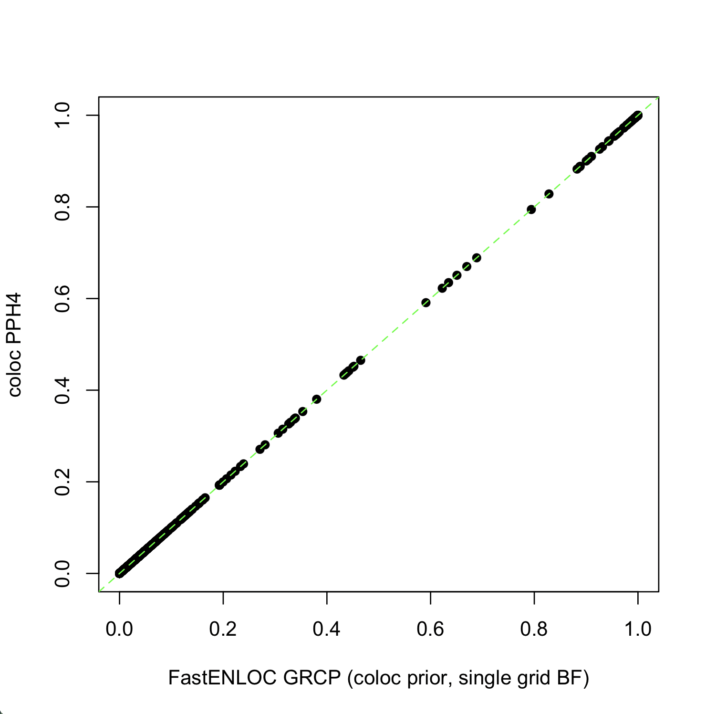
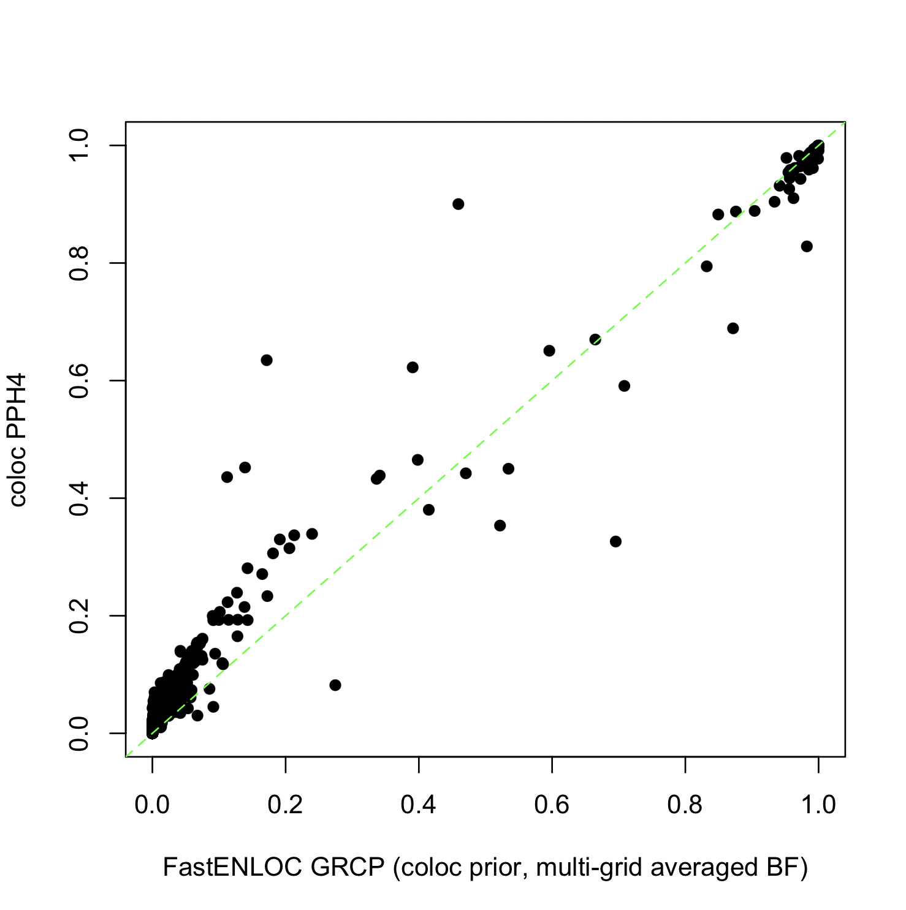
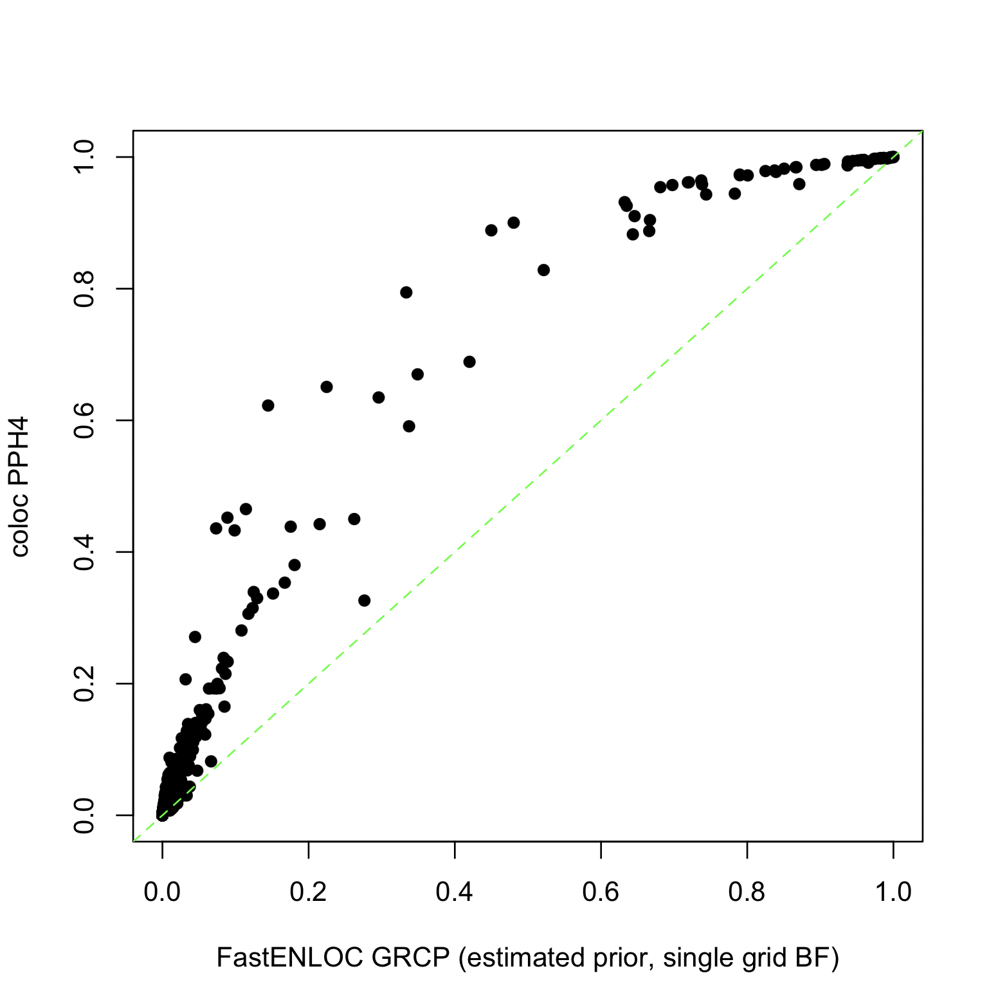
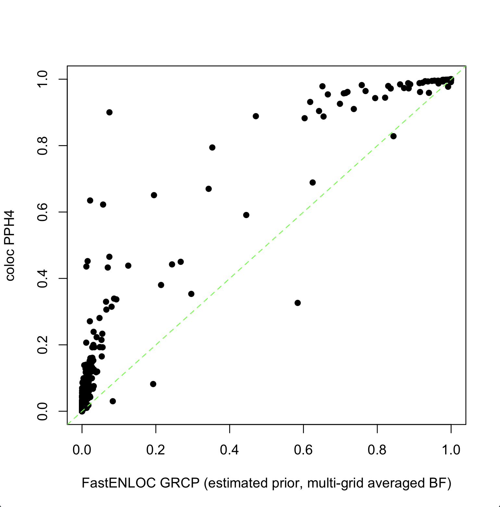
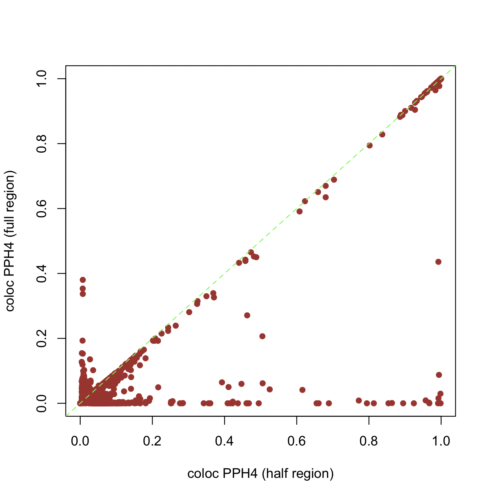

# FastENLOC vs. Coloc using Summary Statistics Input

When summary statistics are used as input for colocalization analysis, both COLOC and FastENLOC require the same simplifying assumption that each trait has at most one causal variant per locus. Consequently, their algorithms for computing colocalization probabilities are nearly identical (see [Wen et al. 2017](https://journals.plos.org/plosgenetics/article?id=10.1371/journal.pgen.1006646) and [Hukku et al. 2021](https://www.cell.com/ajhg/fulltext/S0002-9297(20)30409-2?_returnURL=https%3A%2F%2Flinkinghub.elsevier.com%2Fretrieve%2Fpii%2FS0002929720304092%3Fshowall%3Dtrue) for details). However, differences in the specification of colocalization priors and hyper-parameter choices when computing Bayes factors (BFs) can lead the two methods to yield numerically different results in practice. Here, we present examples to illustrate and explain some of these discrepancies.


<br>
<br>


## 1. When Everything Being Equal

To demonstrate that COLOC and FastENLOC yield comparable results when using summary statistics input, we first analyze the ``coloc_test_data`` included in the ``coloc`` package. This dataset contains 500 SNPs from a single locus. We have reformatted it into a FastENLOC-compatible summary statistics input file, which can be downloaded[here](../sample_data/coloc_test_data.sum). 

The procedure of running COLOC is described in [here](https://chr1swallace.github.io/coloc/articles/a03_enumeration.html). The output from COLOC is as follows:

```
Coloc analysis of trait 1, trait 2

SNP Priors
   p1    p2   p12
1e-04 1e-04 1e-05

Hypothesis Priors
       H0   H1   H2       H3    H4
 0.892505 0.05 0.05 0.002495 0.005

Posterior
       nsnps           H0           H1           H2           H3           H4
5.000000e+02 1.377000e-18 2.937336e-10 8.593226e-12 8.338917e-04 9.991661e-01
```


### 1.1 Running FastenLOC

To align FastENLOC with COLOC’s settings on priors and hyperparameters, we use the following command to run FastENLOC:

```
fastenloc -sum coloc_test_data.sum --coloc_default_prior -sdy_e 1.099961 -sdy_g 1.021844 -prefix test_coloc
```

The on-screen output by FastENLOC is as follows:

```
		==================================================================

		                    FastENLOC (v3.1)

		              release date: November, 2024

		==================================================================

Applying user-specified colocalization priors, skipping enrichment analysis

converting enrichment parameters:
 Intercept    -9.210
Enrichment     6.908

Processing combined summary statistics input ...

    * read in 500 SNPs, 1 loci

Computing colocalization probabilities ...

[==================================================] 100%

FastENLOC analysis is completed
```

Note that ``--coloc_default_prior`` is equivalent to setting ``-p1 1e-4 -p2 1e-4 -p12 1e-5``, which matches the default priors assumed by COLOC. The values for -sdy_e and -sdy_g are required to set hyperparameters for calculating Bayes factors. These can be computed from the datasets and provided to both COLOC and FastENLOC.

FastENLOC detects that colocalization priors are specified in the command line, so it skips enrichment analysis and converts the priors to the equivalent values of $\alpha_0 = -9.21$ and $\alpha_1 = 6.908$.

### 1.2 Comparing the Results

The locus-level FastENLOC results are saved in the file ``test_coloc.enloc.sig.out``, which contains a single line in this example:

```
Signal  Num_SNP CPIP_qtl        CPIP_gwas_marginal      CPIP_gwas_qtl_prior     RCP     LCP
            Loc    500  1.000e+00 1.000e+00    1.000e+00      9.992e-01 1.000e+00
```

It is important to note that 

$$ \text{RCP} = \text{PPH4} $$

and 

$$ \text{LCP} = \text{PPH4} + \text{PPH3} $$

by their respective definitions. In this example, it is not surprising that the locus-level quantification of colocalization evidence is numerically identical between COLOC and FastENLOC, as we have carefully matched all parameters.

The SNP-level colocalization probabilities can be found in the file ``test_coloc.enloc.snp.out``, as shown below:

```
Signal  SNP     PIP_qtl PIP_gwas_marginal       PIP_gwas_qtl_prior      SCP
            Loc          Loc:s103   2.633e-02 2.273e-01    1.138e-02      1.097e-02
            Loc          Loc:s105   9.558e-01 5.640e-01    9.882e-01      9.881e-01
```
To output all variants without thresholding, use the ``--output_all`` option on command line.

The output by COLOC also have these two SNPs with SNP.PP.H4 > 0.01:

```
   snp position     SNP.PP.H4
    6 s103      0.01098066
    8 s105      0.98894507
```      

The figure below shows comparison between FastENLOC SCP values and COLOC SNP.PP.H4 values across all 500 SNPs in this dataset at the log10 scale. 
<center>

</center>
<br>

### 1.3 Conclusions

When all other factors are equal, the two methods yield very similar results, as expected. 

Next, we examine analytical factors that contribute to differences in the quantification of colocalization evidence when using the same input data and applying the simplifying fine-mapping assumption of at most one causal variant per locus.

<br>
<br>


## 2. What Causes Differences? 

To explore the factors contributing to differences between PPH4 and GRCP, we use a simulated dataset generated by [Okamoto et al. 2023](https://www.cell.com/ajhg/fulltext/S0002-9297(22)00536-5). This dataset includes 1,198 genes from chromosome 5, with each gene’s cis region containing 1,500 non-overlapping common SNPs. The gene expression levels and complex traits are simulated using real genotypes from 500 GTEx samples. We are using the [summary statistic input file](../sample_data/okamoto_sim.sum_stats.gz) in this analysis.

To construct a starting point, we set all parameters between FastENLOC and COLOC the same values. These include:

+ Bayes Factor prior effect size grid: sdY values in all traits are set to 1 and BFs are computed using a single effect size prior values.
+ Colocalization priors: $p_1 = 10^{-4}, p_2 = 10^{-4}, p_{12} = 10^{-5}$

With the wrapper R script [``run_coloc.R``](../utility/run_coloc.R), one can run COLOC directly on the FastENLOC summary statistics input file as follows:
```
Rscript run_coloc.R okamoto_sim.sum_stats.gz
```

To run FastENLOC, use
```
fastenloc -sum okamoto_sim.sum_stats.gz -tv 1797000 --coloc_default_prior -sdy_e 1 -sdy_g 1 
```
The figure below shows that the PPH4 values generated by COLOC and the GRCP values generated by FastENLOC are nearly identical in this setting.

<center>

</center>
<br>

### 2.1 Computing Bayes Factors

By default, FastENLOC computes the BFs across a range of prior effect sizes and averages the results to obtain a final value, a strategy advocated by [Stephens and Balding, 2009](https://www.nature.com/articles/nrg2615). This is equivalent to assuming a mixture normal distribution on the prior genetic effect size
In comparison, COLOC computes Bayes factor based on a single effect size prior determined by sdY. 
This subtle difference, which is not directly related to colocalization analysis, can lead to discrepancy in final colocalization probabilities. 

The figure below show the GRCPs using averaged BF results versus COLOC's PPH4 values using a single grid:


<center>

</center>
<br>
The FastENLOC results are obtained by 
```
fastenloc -sum okamoto_sim.sum_stats.gz -tv 1797000 --coloc_default_prior
```

The results demonstrate that colocalization probabilities are sensitive to prior effect specifications. Generally, as argued by[Stephens and Balding, 2009](https://www.nature.com/articles/nrg2615) and many others, averaged BFs are considered more robust.


### 2.2 Prior Specification

FastENLOC can estimate colocalization priors directly from the data using a multiple imputation scheme, which is also applicable to summary statistics input.
For the Okamoto data, the true enrichment parameters are $\alpha_0 = -7.311$  and $\alpha_1 = 5.809$. 
The estimates by FastENLOC are conservative, as expected:

```
                Intercept    -7.665           -
Enrichment (no shrinkage)     4.739       0.146
Enrichment (w/ shrinkage)     4.549       0.143

## Alternative (coloc) parameterization: p1 = 4.683e-04, p2 = 5.660e-04, p12 = 2.508e-05
```

The alternative parameterization, i.e., ($p_1, p_2, p_{12}$), shows that the estimated prior is reasonably close to the default prior assumed by COLOC. 
The impact on colocalization probabilities by the prior difference is shown below:

<center>

</center>
<br>
Here, we maintain consistent Bayes factor (BF) computations across both methods (assuming a single grid by defining sdY).
The command used to generate the above FastENLOC output is:

```
fastenloc -sum okamoto_sim.sum_stats.gz -tv 1797000 -sdy_g 1 -sdy_e 1
```

Since the corresponding $\alpha_1$ value (6.908) overestimates the true value, the PPH4 values are higher than the corresponding GRCP values.


### 2.3 The Combined Effect

When FastENLOC and COLOC use their respective default settings to compute colocalization probabilities, a higher level of discordance is observed between PPH4 and GRCP, as shown below.
<center>

</center>
<br>
The command to generate the above FastENLOC output is:

```
fastenloc -sum okamoto_sim.sum_stats.gz -tv 1797000 
```

### 2.4 Non-analytical Factors

While analytical factors can contribute to discrepancies in colocalization quantification between FastENLOC and COLOC, their results generally remain highly correlated. For instance, in the combined effect experiment, the GRCP and PPH4 results show a Spearman correlation of 0.905. We also identify a non-analytical cause of larger discrepancies between and within methods that perform colocalization analysis based on summary statistics input: the definition of gene (cis) regions.

The figure below shows the changes in PPH4 values computed by COLOC as the cis-region for each gene is halved in the Okamoto data.

<center>

</center>
<br>
This also causes a drastic decrease in Spearman’s correlation to 0.161.

Sensitivity to region definition is a primary reason we recommend probabilistic fine-mapping input for colocalization analysis, as it is more robust to different region definitions.
