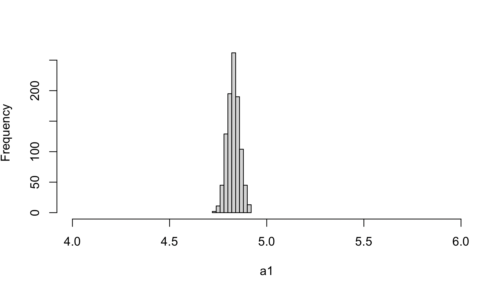

# Demonstration of FastENLOC Enrichment Analysis


## 1. Dataset and Truth

We use a simulated data by [Okamoto et al. 2023](https://www.cell.com/ajhg/fulltext/S0002-9297(22)00536-5) to demonstrate the FastENLOC enrichment analysis. 
This dataset includes 1,198 genes from chromosome 5, with each gene’s cis region containing 1,500 non-overlapping common SNPs. The gene expression levels and complex traits are simulated using real genotypes from 500 GTEx samples.
We provide all three types of FastENLOC input formats:

+ probabilistic fine-mapping input: [eqtl annotations](https://github.com/xqwen/fastenloc/tree/master/sample_data/okamoto_sim.eqtl.vcf.gz) and [GWAS annotations](https://github.com/xqwen/fastenloc/tree/master/sample_data/okamoto_sim.gwas.vcf.gz) generated by ``DAP-G``
+ combined summary statistics input: [combined summary statistics](https://github.com/xqwen/fastenloc/tree/master/sample_data/okamoto_sim.sum_stats.gz)
+ hybrid input: [eqtl annotation](https://github.com/xqwen/fastenloc/tree/master/sample_data/okamoto_sim.eqtl.vcf.gz) and [GWAS summary statistics](https://github.com/xqwen/fastenloc/tree/master/sample_data/okamoto_sim.gwas_sum.gz)

In the simulation scheme,

1.	Two eQTLs are randomly selected for each gene.
2.	A subset of 218 genes is simulated as “causal” genes, with their eQTLs colocalized with GWAS hits
3.	An additional pleiotropic GWAS variant is randomly selected for each gene

The total $1198 \times 1500 = 1797000$ SNPs can be classified into the following 4 mutually exclusive categories:

1. Colocalized eQTL and GWAS SNPs: $C_{11} = 218 \times 2 = 436$ SNPs
2. GWAS SNPs that are not eQTLs: $C_{01} = 1198$ pleiotropic SNPs
3. eQTL SNPs that are not GWAS hits: $C_{10} = (1198-218) \times 2 = 1960$ SNPs
4. SNPs that neither eQTLs nor GWAS hits: $C_{00} = 1797000 - 436 - 1198 - 1960 = 1793406$ SNPs

By constructing a $2 \times 2$ contingency table, we obtain the true $(\alpha_0, \alpha_1)$ values:

$$ \alpha_0 = \log\left[ \frac{C_{01}}{C_{00}}\right] = -7.31, $$

and

$$ \alpha_1 = \log\left[\frac{C_{00}C_{11}}{C_{10} C_{01}}\right] = 5.81 $$

The genetic effect for each eQTL and GWAS hit is independently drawn from a normal distribution,  $\text{N}(0, 0.6^2)$ . Consequently, a large proportion of causal variants exhibit small to modest effects, mimicking a setting often observed in real data.

<br>
<br>

## 2. Enrichment with Probabilistic Fine-mapping Input 

To perform only enrichment analysis with the probabilistic fine-mapping input, use the following command:
```
fastenloc -e okamoto_sim.eqtl.vcf.gz -g okamoto_sim.gwas.vcf.gz -tv 1797000 --enrich
```

The ``--enrich`` flag instructs FastENLOC to exclusively perform enrichment analysis, bypassing the computation of colocalization probabilities.

The enrichment result is saved in ``enloc.enrich.out``:

```
                Intercept    -7.724           -
Enrichment (no shrinkage)     4.909       0.123
Enrichment (w/ shrinkage)     4.768       0.122

## Alternative (coloc) parameterization: p1 = 4.414e-04, p2 = 7.459e-04, p12 = 3.880e-05
```

To increase multiple imputation rounds to 100 from the default 25, use the ``-imp 100`` option:
```
fastenloc -e okamoto_sim.eqtl.vcf.gz -g okamoto_sim.gwas.vcf.gz -tv 1797000 --enrich -imp 100
```
The output is:

```
                Intercept    -7.723           -
Enrichment (no shrinkage)     4.899       0.123
Enrichment (w/ shrinkage)     4.759       0.122

## Alternative (coloc) parameterization: p1 = 4.418e-04, p2 = 7.462e-04, p12 = 3.849e-05
```

To further increase the imputation rounds to 1000, the output remains similar:
```
                Intercept    -7.723           -
Enrichment (no shrinkage)     4.899       0.124
Enrichment (w/ shrinkage)     4.758       0.122

## Alternative (coloc) parameterization: p1 = 4.418e-04, p2 = 7.462e-04, p12 = 3.844e-05
```

Users can plot the histogram of $\alpha_1$ estimates from each imputation round based on the detailed information provided in ``enloc.mi.out``.

<center>

</center>


<br>
<br>

## 3. Enrichment with Combined Summary Statistics Input

FastENLOC analysis can be performed using summary statistics input:

```
fastenloc -sum okamoto_sim.sum.gz -tv 1797000 --enrich
```

The results shown in ``enloc.enrich.out`` are:

```
                Intercept    -7.665           -
Enrichment (no shrinkage)     4.739       0.146
Enrichment (w/ shrinkage)     4.549       0.143

## Alternative (coloc) parameterization: p1 = 4.683e-04, p2 = 5.660e-04, p12 = 2.508e-05
```

As expected, the $\alpha_1$ value is further underestimated compared to the probabilistic fine-mapping input due to the assumption of “at most one causal variant per locus per trait” required for summary statistics input.

With the increased imputation rounds to 1000, the estimate remains stable:

```
fastenloc -sum okamoto_sim.sum.gz -tv 1797000 --enrich -imp 1000
```

```
                Intercept    -7.665           -
Enrichment (no shrinkage)     4.740       0.145
Enrichment (w/ shrinkage)     4.551       0.142

## Alternative (coloc) parameterization: p1 = 4.682e-04, p2 = 5.659e-04, p12 = 2.513e-05
```

<br>
<br>

## 4. Enrichment with Hybrid Input

The enrichment analysis can also be performed using a hybrid input format, which was mostly used in previous versions of FastENLOC.
With the hybrid input, use the following command for enrichment analysis:

```
fastenloc -e okamoto_sim.eqtl.vcf.gz -gs okamoto_sim.gwas_sum.gz  -tv 1797000 --enrich
```

The results indicate a higher degree of underestimation of $\alpha_1$, but is also stable with increased imputation rounds:

```
                Intercept    -7.663           -
Enrichment (no shrinkage)     4.421       0.147
Enrichment (w/ shrinkage)     4.242       0.144

## Alternative (coloc) parameterization: p1 = 4.693e-04, p2 = 7.598e-04, p12 = 2.483e-05
```

## 5. Conclusions

This example, along with numerous practical applications and simulations we’ve observed, demonstrates that FastENLOC can provide reasonable estimates of the required colocalization probabilities for downstream analysis. FastENLOC’s estimates of $(\alpha_0, \alpha_1)$ tend to be conservative, which is partially by design (e.g., the shrinkage applied to $\hat{\alpha}_1$) to reduce the risk of potential false positives. More importantly, this underestimation arises from the lack of power in genetic association analysis of each individual trait, a point thoroughly illustrated by [Hukku et al., 2021](https://www.cell.com/ajhg/fulltext/S0002-9297(20)30409-2). In this specific data example, fine-mapping analysis only confidently identifies a small proportion of genuine genetic association signals.


The summary statistics input, which prompts FastENLOC to apply the simplifying assumption of “at most one causal variant per trait per locus,” understandably leads to more conservative estimates, as this assumption is not met in the simulated dataset. The hybrid input provides the most conservative estimates, primarily due to mismatched resolutions between eQTL and GWAS association signals.

Nevertheless, all three can be considered reasonable colocalization priors for downstream colocalization probability calculations, thereby eliminating the need to “guess” a subjective prior.