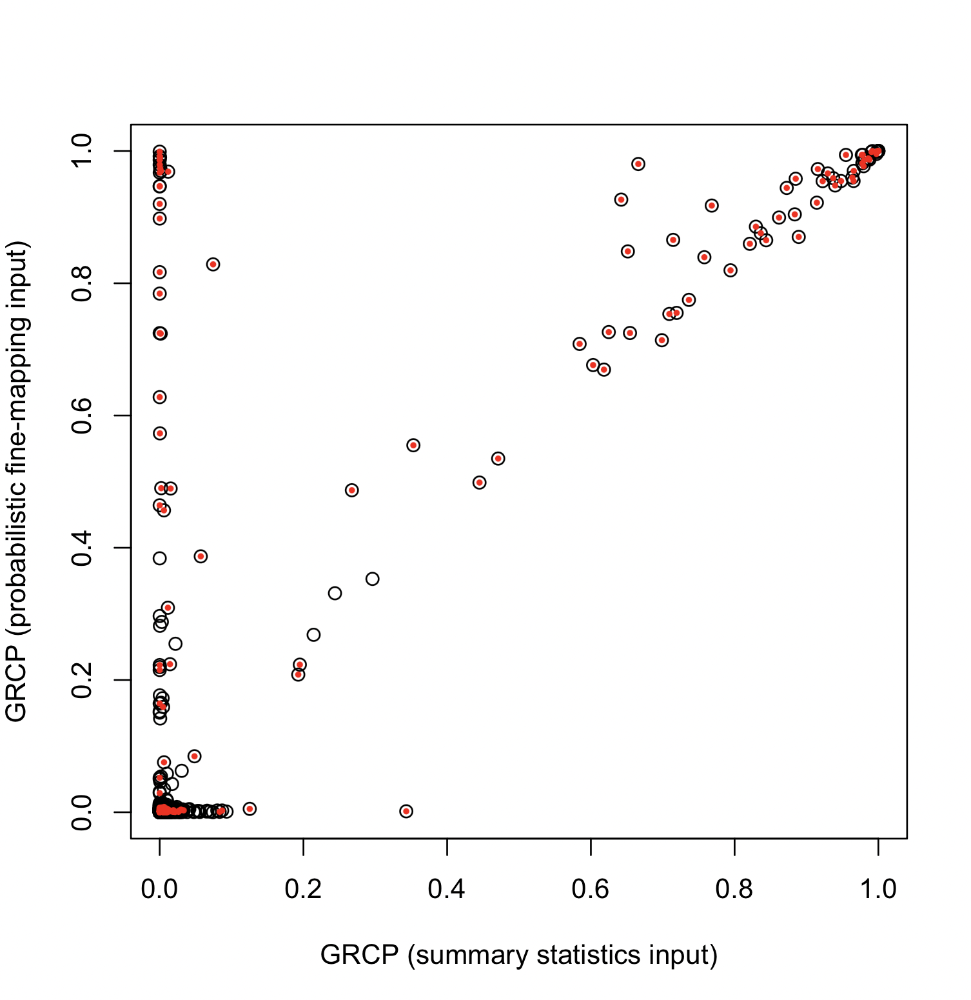
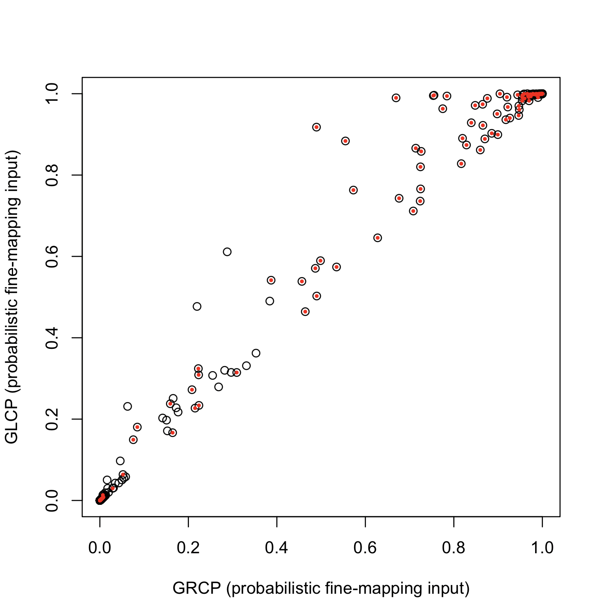

# Running FastENLOC with Probabilistic Fine-mapping vs. Summary Statistics Input

Probabilistic fine-mapping is the recommended input option for FastENLOC. However, using summary statistics offers unique advantages for practitioners. Specifically, it is easily accessible, as most genetic studies publicly release summary statistics, and convenient to prepare, as it requires no additional computational processing.
Here, We use a simulated dataset from [Okamoto et al. 2023](https://www.cell.com/ajhg/fulltext/S0002-9297(22)00536-5) to evaluate the performance trade-offs in colocalization analysis between summary statistics input and probabilistic fine-mapping input.
This dataset includes 1,198 genes from chromosome 5, with each gene’s cis region containing 1,500 non-overlapping common SNPs. The gene expression levels and complex traits are simulated using real genotypes from 500 GTEx samples.


## 1. Analysis with Probabilistic Fine-mapping Input

There are two input files:
+ [okamoto_sim.eqtl.vcf.gz](https://github.com/xqwen/fastenloc/tree/master/sample_data/okamoto_sim.eqtl.vcf.gz)
+ [okamoto_sim.gwas.vcf.gz](https://github.com/xqwen/fastenloc/tree/master/sample_data/okamoto_sim.gwas.vcf.gz)


The analysis results are obtained by running
```
fastenloc -e okamoto_sim.eqtl.vcf.gz -g okamoto_sim.gwas.vcf.gz -tv 1797000 -prefix fm_rst
```

## 2. Analysis with Summary Statistics Input

There is a single input file for combined summary statistics input
+ [okamoto_sim.sum_stats.gz](https://github.com/xqwen/fastenloc/tree/master/sample_data/okamoto_sim.sum_stats.gz)

The analysis results are obtained by running
```
fastenloc -e okamoto_sim.sum_stats.gz -tv 1797000 -prefix ss_rst
```

## 3. Comparison of Enrichment Analysis

Interestingly, both types of input give similar enrichment analysis results, despite that they are both conservative.
For probabilistic fine-mapping input, the resulting enrichment estimates are:
```
                Intercept    -7.724           -
Enrichment (no shrinkage)     4.909       0.123
Enrichment (w/ shrinkage)     4.768       0.122

## Alternative (coloc) parameterization: p1 = 4.414e-04, p2 = 7.459e-04, p12 = 3.880e-05
```
The summary statistics input yields more conservative $\alpha_1$ estimates:
```
                Intercept    -7.665           -
Enrichment (no shrinkage)     4.739       0.146
Enrichment (w/ shrinkage)     4.549       0.143

## Alternative (coloc) parameterization: p1 = 4.683e-04, p2 = 5.660e-04, p12 = 2.508e-05
```

More detailed discussion in enrichment analysis can be found [here](enrichment_demo.md).

## 4. Comparison of GRCP Output 

The gene-level quantification of colocalization evidence quantified by GRCP is primarily used for downstream analysis. 
 The figure below compares GRCP values across all 1,198 genes:
<center>

</center>
<br>

In this figure, red dots represent genes that truly harbor colocalized variants (based on the [simulation truth](https://github.com/xqwen/fastenloc/tree/master/sample_data/okamoto_sim.casusal_gene.truth) ). It is evident that probabilistic fine-mapping input outperforms summary-statistics input.

Applying the Bayesian FDR control procedure for the GRCPs at 5% level, we obtain the following results:

|     | Rejections | Realized FDR | Power
| -------- | -------    |------- | ------
| GRCP (Probabilistic Fine-mapping)  | 60 | 0.000 | 0.275
| GRCP (Summary Statistics) | 38 | 0.000 | 0.170


## 5. Use GLCP as Colocalization Evidence

[Hukku et al., 2021](https://www.cell.com/ajhg/fulltext/S0002-9297(20)30409-2) advocates for the use of GLCP to quantify colocalization evidence and reduce Class II false negatives. When using probabilistic fine-mapping as input, we observe an improvement in colocalization quantification, as demonstrated in the figure below:
<center>

</center>
<br>

However, this approach is only applicable to probabilistic fine-mapping input, where loci are defined by signal clusters or credible sets inferred from fine-mapping analysis. These regions are typically narrow, and all member SNPs are likely to be causal.

In contrast, **the proposal by Hukku et al. is entirely unsuitable for GLCPs computed from summary statistics input**, as indicated by the following Bayesian FDR control results (set at a 5% control level).

|     | Rejections | Realized FDR | Power
| -------- | -------    |------- | ------
| GLCP (Probabilistic Fine-mapping)  | 76 | 0.000 | 0.349
| GLCP (Summary Statistics) | 679 | 0.778* | 0.693*

